# Diagram podróży użytkownika - Moduł Autentykacji i Rejestracji

Diagram przedstawia kompleksową podróż użytkownika w aplikacji PriceHistory, obejmującą proces rejestracji, logowania, oraz korzystania z głównych funkcjonalności systemu.

```mermaid
stateDiagram-v2
    [*] --> StronaGlowna
    
    note right of StronaGlowna
        Landing page z prezentacją
        aplikacji i value proposition
    end note
    
    state "Strona Główna" as StronaGlowna {
        [*] --> PrezentacjaAplikacji
        PrezentacjaAplikacji --> DecyzjaUzytkownika
    }
    
    state decyzja_logowanie <<choice>>
    DecyzjaUzytkownika --> decyzja_logowanie
    decyzja_logowanie --> StronaRejestracji: Nowy użytkownik
    decyzja_logowanie --> StronaLogowania: Mam konto
    
    state "Proces Rejestracji" as ProcesRejestracji {
        [*] --> FormularzRejestracji
        
        note right of FormularzRejestracji
            Pola: email, hasło,
            potwierdzenie hasła, captcha
        end note
        
        FormularzRejestracji --> WalidacjaRejestracji
        
        state walidacja_rejestracji <<choice>>
        WalidacjaRejestracji --> walidacja_rejestracji
        
        walidacja_rejestracji --> BladRejestracji: Błąd walidacji
        walidacja_rejestracji --> SprawdzenieRateLimit: Dane poprawne
        
        state rate_limit_check <<choice>>
        SprawdzenieRateLimit --> rate_limit_check
        rate_limit_check --> BladRateLimit: Przekroczono limit 3 na 24h
        rate_limit_check --> SprawdzenieEmailu: OK
        
        state email_exists <<choice>>
        SprawdzenieEmailu --> email_exists
        email_exists --> BladEmailIstnieje: Email zajęty
        email_exists --> TworzenieKonta: Email wolny
        
        TworzenieKonta --> WyslanieMailaWeryfikacyjnego
        WyslanieMailaWeryfikacyjnego --> StronaWeryfikacji
        
        BladRejestracji --> FormularzRejestracji
        BladRateLimit --> FormularzRejestracji
        BladEmailIstnieje --> FormularzRejestracji
    }
    
    StronaRejestracji --> ProcesRejestracji
    
    state "Weryfikacja Email" as StronaWeryfikacji {
        [*] --> KomunikatSprawdzEmail
        KomunikatSprawdzEmail --> OczekiwanieNaKlikniecie
        
        note right of OczekiwanieNaKlikniecie
            Użytkownik może ponownie
            wysłać link weryfikacyjny
            max 1 na minutę
        end note
        
        OczekiwanieNaKlikniecie --> CallbackWeryfikacji: Kliknięcie w link
        OczekiwanieNaKlikniecie --> PowtorneWyslanie: Wyślij ponownie
        PowtorneWyslanie --> OczekiwanieNaKlikniecie
    }
    
    state weryfikacja_callback <<choice>>
    CallbackWeryfikacji --> weryfikacja_callback
    weryfikacja_callback --> DashboardZalogowany: Token poprawny
    weryfikacja_callback --> BladWeryfikacji: Token błędny
    BladWeryfikacji --> StronaLogowania
    
    state "Proces Logowania" as ProcesLogowania {
        [*] --> FormularzLogowania
        
        note right of FormularzLogowania
            Pola: email, hasło
            Link do odzyskiwania hasła
        end note
        
        FormularzLogowania --> WalidacjaDanychLogowania
        
        state logowanie_walidacja <<choice>>
        WalidacjaDanychLogowania --> logowanie_walidacja
        
        logowanie_walidacja --> SprawdzeniePoswiadczen: Format OK
        logowanie_walidacja --> BladFormatuDanych: Format błędny
        
        state poswiadczenia_check <<choice>>
        SprawdzeniePoswiadczen --> poswiadczenia_check
        poswiadczenia_check --> SprawdzenieWeryfikacjiEmail: Dane poprawne
        poswiadczenia_check --> BladNieprawidloweDane: Dane nieprawidłowe
        
        state email_verified <<choice>>
        SprawdzenieWeryfikacjiEmail --> email_verified
        email_verified --> TworzenieSesji: Email zweryfikowany
        email_verified --> BladEmailNiezweryfikowany: Email niezweryfikowany
        
        TworzenieSesji --> TworzeniePreferencji
        TworzeniePreferencji --> UstawienieCookies
        
        BladFormatuDanych --> FormularzLogowania
        BladNieprawidloweDane --> FormularzLogowania
        BladEmailNiezweryfikowany --> FormularzLogowania
    }
    
    StronaLogowania --> ProcesLogowania
    UstawienieCookies --> DashboardZalogowany
    
    state "Strefa Zalogowanego Użytkownika" as StrefaZalogowana {
        [*] --> Middleware
        
        note right of Middleware
            Każde żądanie przechodzi
            przez sprawdzenie sesji
        end note
        
        state sesja_check <<choice>>
        Middleware --> sesja_check
        sesja_check --> DashboardZalogowany: Sesja aktywna
        sesja_check --> PrzelogowanieSesjaWygasla: Sesja wygasła
        
        state "Dashboard" as DashboardZalogowany {
            [*] --> PobranieDanych
            
            state dane_dashboard <<choice>>
            PobranieDanych --> dane_dashboard
            dane_dashboard --> WidokPusty: Brak ofert
            dane_dashboard --> WidokZOfertami: Są oferty
            
            note right of WidokPusty
                Empty state z tooltipem
                Dodaj pierwszą ofertę
            end note
            
            WidokPusty --> AkcjaDashboard
            WidokZOfertami --> AkcjaDashboard
            
            state akcja_dashboard <<choice>>
            AkcjaDashboard --> akcja_dashboard
            akcja_dashboard --> DodawanieOferty: Dodaj ofertę
            akcja_dashboard --> PrzegladanieOferty: Zobacz szczegóły
            akcja_dashboard --> UsuniecieOferty: Usuń ofertę
            akcja_dashboard --> Ustawienia: Przejdź do ustawień
            akcja_dashboard --> Wylogowanie: Wyloguj się
            
            UsuniecieOferty --> PobranieDanych
        }
        
        state "Dodawanie Oferty" as DodawanieOferty {
            [*] --> FormularzURL
            
            note right of FormularzURL
                Walidacja domeny otomoto.pl
                Maksymalnie 3 kliki do dodania
            end note
            
            FormularzURL --> WalidacjaURL
            
            state url_validation <<choice>>
            WalidacjaURL --> url_validation
            url_validation --> SprawdzenieLimitu: URL poprawny
            url_validation --> BladNieprawidlowyURL: URL błędny
            
            state limit_check <<choice>>
            SprawdzenieLimitu --> limit_check
            limit_check --> PobranieHTML: Poniżej limitu 5
            limit_check --> BladLimitOfert: Limit osiągnięty
            
            PobranieHTML --> EkstrakcjaAI
            
            note right of EkstrakcjaAI
                AI znajduje cenę, tytuł,
                zdjęcie, walutę przez
                OpenRouter API
            end note
            
            state ai_confidence <<choice>>
            EkstrakcjaAI --> ai_confidence
            ai_confidence --> PodgladOferty: Confidence >= 0.8
            ai_confidence --> FallbackPatterns: Confidence < 0.8
            
            FallbackPatterns --> podglad_fallback
            state podglad_fallback <<choice>>
            podglad_fallback --> PodgladOferty: Znaleziono cenę
            podglad_fallback --> BladEkstrakcji: Nie znaleziono
            
            PodgladOferty --> PotwierdzenieDodania
            
            state potwierdzenie <<choice>>
            PotwierdzenieDodania --> potwierdzenie
            potwierdzenie --> ZapisOferty: Zapisz
            potwierdzenie --> FormularzURL: Anuluj
            
            ZapisOferty --> PierwszyWpisHistorii
            PierwszyWpisHistorii --> historia_zapisana
            
            BladNieprawidlowyURL --> FormularzURL
            BladLimitOfert --> historia_zapisana
            BladEkstrakcji --> FormularzURL
        }
        
        state historia_zapisana <<fork>>
        historia_zapisana --> DashboardZalogowany
        historia_zapisana --> AutomatyczneSprawdzanie
        
        state "Automatyczne Monitorowanie" as AutomatyczneSprawdzanie {
            [*] --> CronJob
            
            note right of CronJob
                Cykliczne sprawdzanie
                zgodnie z częstotliwością
                domyślnie co 24h
            end note
            
            CronJob --> PobranieAktywnychOfert
            PobranieAktywnychOfert --> IteracjaPoOfertach
            IteracjaPoOfertach --> PobranieHTMLOferty
            PobranieHTMLOferty --> EkstrakcjaCeny
            
            state ekstrakcja_ceny <<choice>>
            EkstrakcjaCeny --> ekstrakcja_ceny
            ekstrakcja_ceny --> WalidacjaCeny: Selektor działa
            ekstrakcja_ceny --> RetryAI: Selektor nie działa
            
            RetryAI --> ekstrakcja_retry
            state ekstrakcja_retry <<choice>>
            ekstrakcja_retry --> WalidacjaCeny: AI znalazł cenę
            ekstrakcja_retry --> MechanizmRetry: Błąd
            
            state walidacja_ceny <<choice>>
            WalidacjaCeny --> walidacja_ceny
            walidacja_ceny --> ZapisHistorii: Cena prawidłowa
            walidacja_ceny --> MechanizmRetry: Cena nieprawidłowa
            
            state retry_decision <<choice>>
            MechanizmRetry --> retry_decision
            retry_decision --> PonownaProba: Próba 1 lub 2
            retry_decision --> StatusError: Próba 3
            retry_decision --> StatusRemoved: HTTP 404 lub 410
            
            PonownaProba --> PobranieHTMLOferty
            
            ZapisHistorii --> AktualizacjaLastChecked
            StatusError --> LogowanieBlad
            StatusRemoved --> LogowanieRemoved
            
            AktualizacjaLastChecked --> SprawdzenieKolejnejOferty
            LogowanieBlad --> SprawdzenieKolejnejOferty
            LogowanieRemoved --> SprawdzenieKolejnejOferty
            
            state kolejna_oferta <<choice>>
            SprawdzenieKolejnejOferty --> kolejna_oferta
            kolejna_oferta --> IteracjaPoOfertach: Są jeszcze oferty
            kolejna_oferta --> ObliczanieSuccessRate: Koniec listy
            
            state success_rate <<choice>>
            ObliczanieSuccessRate --> success_rate
            success_rate --> AlertDeweloperow: Success rate < 85%
            success_rate --> ZakonczenieCyklu: Success rate >= 85%
            
            AlertDeweloperow --> ZakonczenieCyklu
            ZakonczenieCyklu --> CronJob
        }
        
        state "Przeglądanie Oferty" as PrzegladanieOferty {
            [*] --> PobranieHistorii
            
            PobranieHistorii --> historia_check
            state historia_check <<choice>>
            historia_check --> WidokSzczegolow: Dane dostępne
            historia_check --> BladPobrania: Błąd
            
            WidokSzczegolow --> WyswietlenieWykresu
            
            note right of WyswietlenieWykresu
                Wykres liniowy zmian cen,
                tabela historii, statystyki
            end note
            
            WyswietlenieWykresu --> AkcjeSzczegoly
            
            state akcje_szczegoly <<choice>>
            AkcjeSzczegoly --> akcje_szczegoly
            akcje_szczegoly --> OtworzNaOtomoto: Zobacz na Otomoto
            akcje_szczegoly --> UsuniecieTejOferty: Usuń ofertę
            akcje_szczegoly --> PowrotDoDashboard: Powrót
            
            OtworzNaOtomoto --> WidokSzczegolow
            UsuniecieTejOferty --> PowrotDoDashboard
            BladPobrania --> PowrotDoDashboard
        }
        
        PowrotDoDashboard --> DashboardZalogowany
        
        state "Ustawienia Konta" as Ustawienia {
            [*] --> PobraniePreferencji
            PobraniePreferencji --> WidokUstawien
            
            WidokUstawien --> AkcjeUstawien
            
            state akcje_ustawien <<choice>>
            AkcjeUstawien --> akcje_ustawien
            akcje_ustawien --> ZmianaHasla: Zmień hasło
            akcje_ustawien --> ZmianaCzestotliwosci: Zmień częstotliwość
            akcje_ustawien --> UsuniecieKonta: Usuń konto
            akcje_ustawien --> PowrotDoDashboard2: Powrót
            
            state "Zmiana Hasła" as ZmianaHasla {
                [*] --> FormularzZmianyHasla
                
                note right of FormularzZmianyHasla
                    Aktualne hasło, nowe hasło
                    potwierdzenie nowego hasła
                end note
                
                FormularzZmianyHasla --> WalidacjaZmianyHasla
                
                state walidacja_hasla <<choice>>
                WalidacjaZmianyHasla --> walidacja_hasla
                walidacja_hasla --> WeryfikacjaAktualnegoHasla: Format OK
                walidacja_hasla --> BladWalidacjiHasla: Format błędny
                
                state aktualne_haslo <<choice>>
                WeryfikacjaAktualnegoHasla --> aktualne_haslo
                aktualne_haslo --> AktualizacjaHasla: Hasło poprawne
                aktualne_haslo --> BladAktualnegoHasla: Hasło nieprawidłowe
                
                AktualizacjaHasla --> WyslanieEmailaOZmianie
                WyslanieEmailaOZmianie --> KomunikatSukcesu
                
                BladWalidacjiHasla --> FormularzZmianyHasla
                BladAktualnegoHasla --> FormularzZmianyHasla
            }
            
            state "Zmiana Częstotliwości" as ZmianaCzestotliwosci {
                [*] --> FormularzCzestotliwosci
                
                note right of FormularzCzestotliwosci
                    Opcje: 6h, 12h, 24h, 48h
                    Dotyczy nowych ofert
                end note
                
                FormularzCzestotliwosci --> ZapisPreferencji
                ZapisPreferencji --> KomunikatZapisano
            }
            
            state "Usunięcie Konta" as UsuniecieKonta {
                [*] --> ModalPotwierdzenia
                
                note right of ModalPotwierdzenia
                    Użytkownik musi wpisać
                    dokładnie tekst USUŃ
                end note
                
                ModalPotwierdzenia --> WpisaniePotwierdzenia
                
                state potwierdzenie_usuniecia <<choice>>
                WpisaniePotwierdzenia --> potwierdzenie_usuniecia
                potwierdzenie_usuniecia --> ProcesDeletion: Wpisano USUŃ
                potwierdzenie_usuniecia --> ModalPotwierdzenia: Anulowano
                
                ProcesDeletion --> SoftDeleteOfert
                SoftDeleteOfert --> AnonimizacjaEmail
                
                note right of AnonimizacjaEmail
                    Email zmieniony na
                    deleted_timestamp@deleted.com
                    Hasło usunięte
                end note
                
                AnonimizacjaEmail --> LogowanieUsunieciaKonta
                LogowanieUsunieciaKonta --> WylogowanieUsunietegoKonta
            }
            
            KomunikatSukcesu --> WidokUstawien
            KomunikatZapisano --> WidokUstawien
        }
        
        PowrotDoDashboard2 --> DashboardZalogowany
        
        state "Wylogowanie" as Wylogowanie {
            [*] --> WywolanieAPILogout
            WywolanieAPILogout --> UsuniecieSesjiBazy
            UsuniecieSesjiBazy --> WyczyszczenieCookies
        }
    }
    
    WyczyszczenieCookies --> StronaGlowna
    WylogowanieUsunietegoKonta --> StronaGlowna
    PrzelogowanieSesjaWygasla --> StronaLogowania
    
    note left of StrefaZalogowana
        Wszystkie strony w tej strefie
        wymagają aktywnej sesji
        weryfikowanej przez middleware
    end note
```

## Legenda

### Kolory i style stanów
- **Standardowe stany**: Prostokąty reprezentujące konkretne etapy podróży
- **Stany złożone**: Grupują powiązane ze sobą stany w logiczne sekcje
- **Punkty decyzyjne (<<choice>>)**: Romby reprezentujące rozgałęzienia logiki
- **Fork/Join (<<fork>>)**: Punkty rozdzielania lub łączenia równoległych ścieży

### Przejścia
- **Strzałki ciągłe**: Główne ścieżki przepływu
- **Etykiety na strzałkach**: Warunki lub akcje powodujące przejście

### Notatki
- **Notatki prawe/lewe**: Dodatkowy kontekst lub szczegóły implementacyjne

## Kluczowe punkty decyzyjne

1. **Middleware auth check**: Weryfikacja sesji przy każdym żądaniu do chronionych stron
2. **Weryfikacja email**: Blokada logowania bez potwierdzonego emaila
3. **Rate limiting**: Ochrona przed nadużyciami (3 rejestracje/24h, 10 dodań ofert/24h)
4. **Limit ofert**: Darmowe konto może obserwować maksymalnie 5 ofert
5. **AI confidence**: Fallback do hardcoded patterns gdy AI ma niską pewność
6. **Retry mechanism**: 3 próby przy błędach scrapingu z rosnącym interwałem

## Ścieżki alternatywne i obsługa błędów

- **Email zajęty**: Komunikat i powrót do formularza rejestracji
- **Rate limit exceeded**: Blokada i komunikat z informacją o limicie
- **Sesja wygasła**: Automatyczne przekierowanie do strony logowania
- **Błąd ekstrakcji AI**: Fallback do wzorców CSS, retry lub komunikat błędu
- **Oferta usunięta (404)**: Zmiana statusu na "removed", zakończenie sprawdzania

## Monitorowanie i alerty

- **Success rate tracking**: System monitoruje skuteczność pobierania cen
- **Alert przy < 85%**: Email do deweloperów gdy success rate spada poniżej progu
- **Logging**: Wszystkie krytyczne operacje są logowane do system_logs

